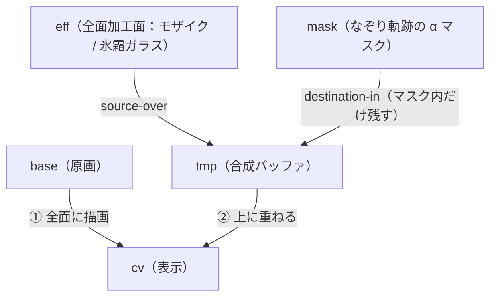

# Frost — 氷霜ガラス・モザイク

指でなぞった場所を**氷霜ガラス／モザイクで隠す** PWA。  
顔・住所・番号など、隠したい所をなぞるだけ。  
**画像は外部に送られず、すべて端末内（ブラウザ）で処理**されます。

🔗 **<https://frost.c12o.net>**

ランタイム依存ライブラリはゼロ（素の TypeScript + Canvas 2D）。

## 特長

- **端末内で完結** — 画像はネットワークに送信されません。読み込みも加工も保存もブラウザ内のみ
- **EXIF / GPS を除去** — 保存時に PNG へ再エンコードするため、元画像の位置情報・撮影メタデータが落ちます
- **2 モード** — 「モザイク」と「氷霜ガラス」（モザイク＋ぼかし＋霜の質感）
- **フリーハンドのブラシ** — 指でなぞった所だけ加工面が現れるソフト円ブラシ
- **4 スライダー** — 粗さ・ぼかし・氷霜・ブラシの太さ
- **ピンチズーム / パン** — 2 本指で拡大・移動、1 本指で描画。長い画像の細部も塗れます
- **PWA** — インストール不要で使え、ホーム画面に追加すればオフラインでも起動
- 取消 / 全消去、保存（iOS は共有シート、それ以外は直接ダウンロード）

## プライバシー

処理はすべてブラウザ内で行われ、画像は外部に出ません。  
Service Worker がキャッシュするのはアプリ本体（アプリシェル）だけで、画像はキャッシュしません。  
トラッキング・解析タグは入れていません。詳細は [プライバシーページ](https://frost.c12o.net/privacy.html) を参照。

## 開発

パッケージマネージャは **pnpm**。

```sh
pnpm install
pnpm dev        # 開発サーバ
pnpm test       # Vitest（watch）
pnpm test:run   # Vitest（CI）
pnpm typecheck  # tsc --noEmit
pnpm build      # 型チェック + 本番ビルド（dist/）
```

## 技術スタック

- **TypeScript + Vite**、素の DOM + Canvas 2D（フレームワーク不使用）
- **vite-plugin-pwa**（generateSW）で Service Worker / manifest を生成
- テストは **Vitest**（コアロジックをユニットで網羅・71 ケース）
- デプロイは Cloudflare Pages（静的サイト）

## 構成

コアロジックは `src/lib/` に副作用なしで隔離し test-first。　　
Canvas / DOM / navigator への依存は `src/app.ts`（配線）と `src/env.ts`（環境検出）に閉じています。

```
index.html         トップ（LP）
app.html           ツール本体
privacy.html       プライバシー
faq.html           FAQ
howto.html         使い方
src/app.ts         配線（Canvas 描画・イベント・ズーム）
src/env.ts         環境検出（detectSaveCaps）
src/styles.css     ツールのスタイル
src/site.css       LP・読み物ページのスタイル
src/lib/           コアロジック（テスト対象・DOM 非依存）
  geometry.ts      座標/スケール変換・containFit/coverFit
  mosaic.ts        モザイク分割計算・Mode 型
  strokes.ts       ストローク reducer・stampPositions
  frost.ts         氷霜 tex → 各レイヤーの不透明度
  viewport.ts      ピンチズーム/パンの相似変換・表示クランプ
  save.ts          保存方式の選択・出力ファイル名
  uiState.ts       ボタン活性・モード gating
assets/            frost_layer.webp（固定霜レイヤー）・sample.svg
public/icons/      PWA アイコン
```

合成の仕組み（4 枚の Canvas）。　　
`表示(cv) = base 全面描画 + ( eff ∩ mask )`:



## ライセンス・クレジット

- ライセンス: **MIT**（Copyright (c) 2026 Seu）
- 作者: **Seu (c12o)**（<https://c12o.net>）
- 霜テクスチャ `assets/frost_layer.webp` および PWA / ファビコンのアイコンは AI 生成画像
